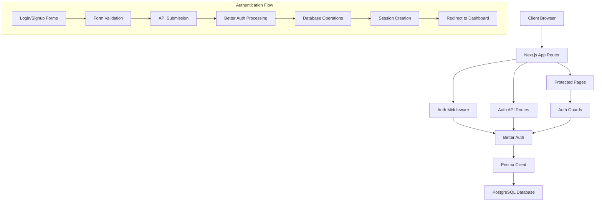

# Design Document

## Overview

This design document outlines the implementation of a comprehensive authentication system for the PropertyMatch platform. The system will leverage the existing Better Auth library, Prisma ORM with PostgreSQL, and Next.js App Router to provide secure user registration, login, and role-based access control for both tenants and landlords.

The authentication system will integrate with the existing UI components and database schema while adding the necessary server-side logic, middleware, and client-side state management to ensure proper security and user experience.

## Architecture

### High-Level Architecture



### Technology Stack

- **Frontend**: Next.js 15 with App Router, React 19, TypeScript
- **Authentication**: Better Auth library with Neon Prisma adapter for session management and security
- **Database**: Neon PostgreSQL with Prisma ORM (environment already configured)
- **UI Components**: Existing Radix UI components with Tailwind CSS
- **Validation**: Zod for form and data validation
- **State Management**: React hooks and Better Auth client

## Components and Interfaces

### 1. Authentication Configuration

**Better Auth Setup** (`src/lib/auth.ts`)
- Configure Better Auth with Neon Prisma adapter
- Set up email/password authentication using existing database schema
- Configure session management with existing Session and Account models
- Define user type validation for TENANT/LANDLORD roles

**Auth Client** (`src/lib/auth-client.ts`)
- Client-side authentication utilities
- Session management hooks
- User state management

### 2. API Routes

**Authentication Endpoints** (`src/app/api/auth/[...auth]/route.ts`)
- Handle Better Auth API routes
- Process login/signup requests
- Manage session operations

### 3. Middleware

**Route Protection** (`middleware.ts`)
- Implement auth guards for protected routes
- Role-based access control
- Automatic redirects for unauthorized access

### 4. Enhanced Form Components

**Updated Login Form** (`src/components/login-form.tsx`)
- Add form state management
- Integrate with Better Auth client
- Handle user type selection
- Implement error handling and validation

**Updated Signup Form** (`src/components/signup-form.tsx`)
- Add form state management
- Integrate with Better Auth client
- Handle user type selection and validation
- Implement password confirmation
- Add error handling

### 5. Protected Pages

**Dashboard Pages**
- Tenant Dashboard (`src/app/dashboard/tenent/page.tsx`)
- Landlord Dashboard (`src/app/dashboard/landlord/page.tsx`)

**Onboarding Pages**
- Tenant Onboarding (`src/app/onboarding/tenent/page.tsx`)
- Landlord Onboarding (`src/app/onboarding/landlord/page.tsx`)

### 6. Authentication Hooks

**Custom Hooks** (`src/hooks/use-auth.ts`)
- `useAuth()`: Get current user and session state
- `useRequireAuth()`: Enforce authentication on components
- `useRoleGuard()`: Enforce role-based access

## Data Models

### User Authentication Flow

The existing Prisma schema is already configured for Neon PostgreSQL and includes the necessary models for Better Auth integration:

```prisma
model User {
  id                   String            @id @default(cuid())
  email                String            @unique
  name                 String?
  userType             UserType          // TENANT | LANDLORD
  // ... other existing fields
  accounts             Account[]
  sessions             Session[]
}

model Account {
  // Better Auth Neon Prisma integration
  password             String?           // For email/password auth
  // ... other existing fields
}

model Session {
  // Better Auth session management with Neon
  // ... existing session fields compatible with Better Auth
}
```

**Database Connection**: The environment is already configured with `DATABASE_URL` pointing to Neon PostgreSQL, so Better Auth will use the existing connection through Prisma.

### Authentication Data Flow

1. **Registration**: User submits form → Validation → Better Auth creates user → Database insert → Session creation → Redirect
2. **Login**: User submits credentials → Better Auth validation → Session creation → Role-based redirect
3. **Route Protection**: Request → Middleware check → Session validation → Role verification → Allow/Deny access

## Error Handling

### Client-Side Error Handling

- **Form Validation Errors**: Display field-specific error messages using existing UI components
- **Network Errors**: Show user-friendly error messages with retry options
- **Authentication Errors**: Clear error messages for invalid credentials or registration issues

### Server-Side Error Handling

- **Database Errors**: Proper error logging and user-friendly responses
- **Validation Errors**: Return structured error responses for form validation
- **Session Errors**: Handle expired or invalid sessions gracefully

### Error Types and Responses

```typescript
interface AuthError {
  type: 'VALIDATION' | 'AUTHENTICATION' | 'AUTHORIZATION' | 'NETWORK';
  message: string;
  field?: string; // For field-specific validation errors
}
```

## Testing Strategy

### Unit Testing Focus Areas

- Form validation logic
- Authentication utility functions
- Role-based access control logic
- Error handling functions

### Integration Testing Focus Areas

- Complete authentication flows (signup → onboarding)
- Role-based redirects
- Session management
- Middleware protection

### Testing Tools and Approach

- **Jest** for unit tests
- **React Testing Library** for component testing
- **Prisma Test Environment** for database testing
- **Mock Better Auth** for isolated testing

### Key Test Scenarios

1. **Successful Registration Flow**
   - Tenant registration → redirect to tenant onboarding
   - Landlord registration → redirect to landlord onboarding

2. **Successful Login Flow**
   - Tenant login → redirect to tenant dashboard
   - Landlord login → redirect to landlord dashboard

3. **Access Control**
   - Unauthenticated users redirected to signin
   - Wrong user type denied access to role-specific pages

4. **Error Handling**
   - Invalid credentials show appropriate errors
   - Duplicate email registration handled properly
   - Network errors handled gracefully

## Security Considerations

### Password Security
- Better Auth handles password hashing and validation
- Minimum password requirements enforced
- Secure session management

### Session Security
- HTTP-only cookies for session tokens
- CSRF protection through Better Auth
- Secure session expiration handling

### Route Protection
- Server-side middleware for route protection
- Client-side guards for UI consistency
- Role-based access control validation

### Data Validation
- Server-side validation for all inputs
- Client-side validation for user experience
- Zod schemas for type-safe validation

## Implementation Phases

### Phase 1: Core Authentication Setup
- Configure Better Auth
- Set up API routes
- Create authentication utilities

### Phase 2: Form Integration
- Update login and signup forms
- Add form state management
- Implement error handling

### Phase 3: Route Protection
- Implement middleware
- Create auth guards
- Set up protected pages

### Phase 4: User Experience
- Add loading states
- Implement proper redirects
- Polish error messages

This design provides a comprehensive, secure, and maintainable authentication system that integrates seamlessly with the existing codebase while meeting all the specified requirements.